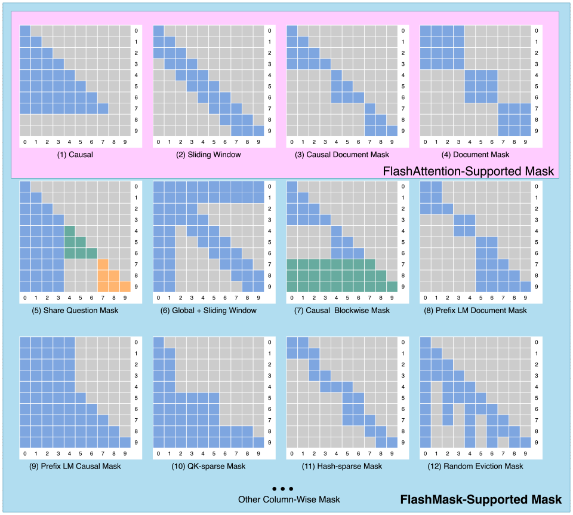

# 1. Challenges of Large Language Models

With the rapid development of artificial intelligence, large models built on the Transformer architecture have shown strong performance in natural language processing, computer vision, and multimodal applications. In these models, attention is a key component. During large model training, the industry typically uses an attention mask to determine which query-key token pairs should participate in valid attention computation.

Current attention masks are usually represented as two-dimensional dense matrices, which causes several problems. First, this representation introduces a large amount of redundant computation because attention between many invalid token pairs still has to be calculated. Second, the space complexity of this mask is $O(N^2)$, where $N$ is the sequence length, which creates significant storage pressure in long-sequence training scenarios and makes efficient training difficult.

To address these problems, the industry has proposed several solutions, such as Memory Efficient Attention (MEA) [1] and FlashAttention [2]. However, the attention mask types supported by these approaches are relatively limited. As shown in Figure 1, FlashAttention supports only a few fixed mask forms, such as pure causal mask, sliding window mask, causal document mask, and document mask. In real training tasks, attention masks are often rich and highly diverse, and current technology still struggles to meet the flexibility requirements of different large model training workloads.

<em>Figure 1: Common types of attention masks</em>

