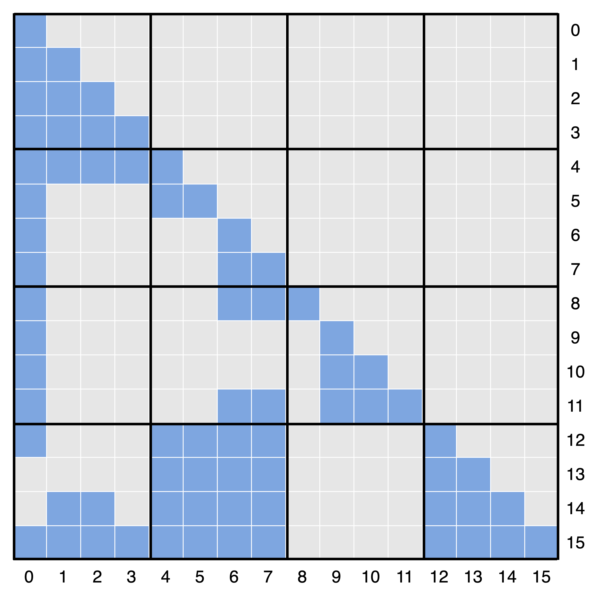
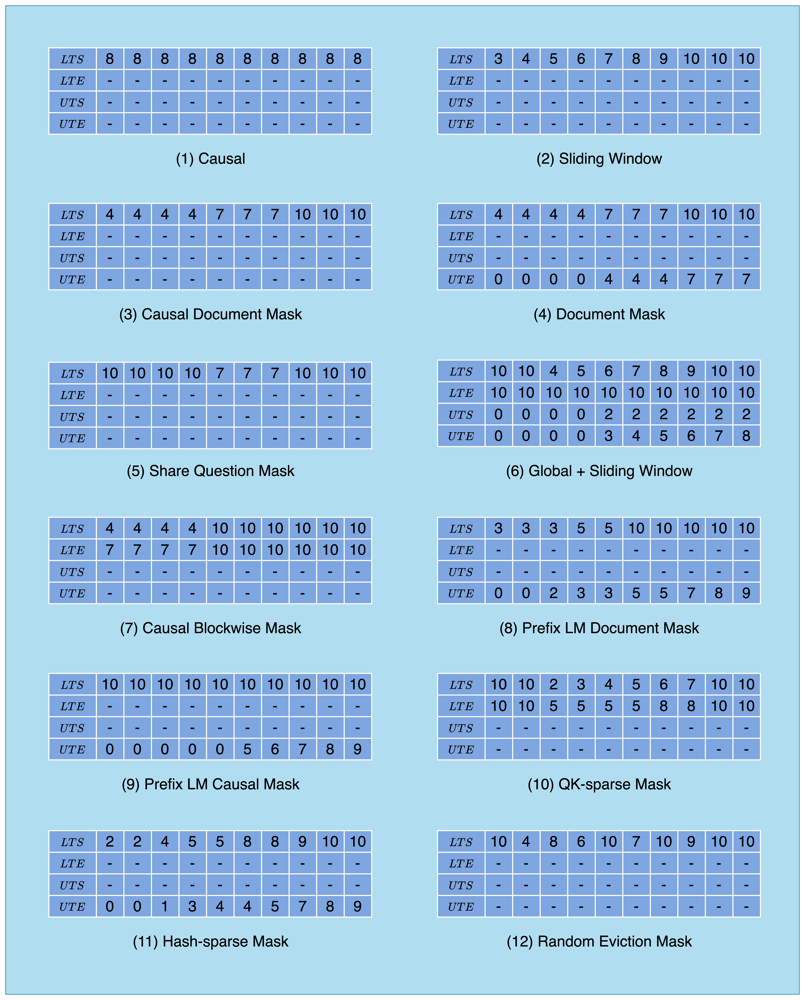
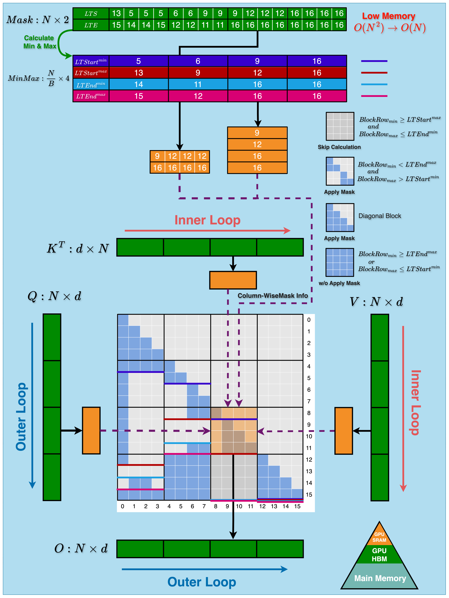
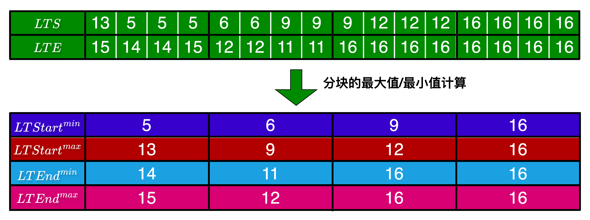
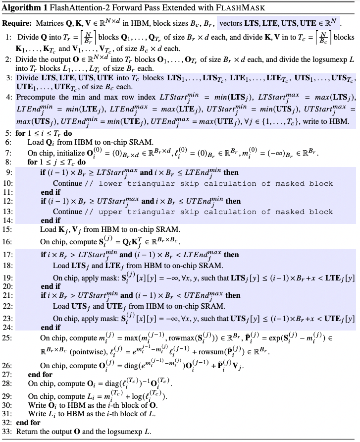

# 2. FlashMask's Innovation: Column-wise Sparse Mask Representation and Efficient Computation

## 2.1 Key Insights

FlashMask's core insight is that, in the attention masks commonly used by large models, the mask pattern across query-key pairs is contiguous. Specifically, for each key token, the query tokens that should not participate in attention form an adjacent interval. In the 2D mask matrix shown in Figure 1, the gray region for each key column is therefore contiguous along the query axis. Based on this observation, FlashMask converts the dense 2D mask matrix into 1D row-index intervals, which provides a more compact representation and significantly reduces storage requirements. This can be expressed as:

$$M_{j} = [start_j, end_j), \quad \forall j \in \{1, \ldots, N\}$$

where $N$ is the key sequence length, $M_j$ is the $j$-th column of the 2D dense mask matrix, and $[start_j, end_j)$ is the contiguous row-index interval indicating that the query tokens from $start_j$ through $end_j - 1$ are masked and excluded from attention computation.

## 2.2 Column-wise Sparse Mask Representation for Attention Masks

To efficiently handle complex mask patterns in causal and bidirectional attention, FlashMask introduces a column-wise sparse representation. Split by the diagonal, it uses four one-dimensional vectors to represent the mask:

* Lower Triangular Start row index (LTS)
* Lower Triangular End row index (LTE)
* Upper Triangular Start row index (UTS)
* Upper Triangular End row index (UTE)

The masked row-index interval in the lower triangle is represented as $[LTS, LTE)$, and the masked row-index interval in the upper triangle is represented as $[UTS, UTE)$.

Figure 2: Schematic of a more complex 2D dense causal attention mask matrix

As shown in Figure 2, we present a more complex 2D dense causal attention mask matrix for attention computation with 16 query tokens and 16 key tokens, where the gray cells represent masked regions.

It can be expressed using the two vectors $[LTS, LTE)$, as shown below:

| col_idx | 0  | 1  | 2  | 3  | 4  | 5  | 6  | 7  | 8  | 9  | 10 | 11 | 12 | 13 | 14 | 15 |
|---------|----|----|----|----|----|----|----|----|----|----|----|----|----|----|----|----|
| $LTS$   | 13 | 5  | 5  | 5  | 6  | 6  | 9  | 9  | 9  | 12 | 12 | 12 | 16 | 16 | 16 | 16 |
| $LTE$   | 15 | 14 | 14 | 15 | 12 | 12 | 11 | 11 | 16 | 16 | 16 | 16 | 16 | 16 | 16 | 16 |

Taking the first column as an example, the mask starts at row 13 and ends at row 15, using an open interval. This means that the query tokens at positions 13 and 14 do not perform valid attention computation with the key token at position 0.

Figure 3: Representing the attention mask pattern in Figure 1 with FlashMask's column-wise sparse mask representation

For more examples, see Figure 3, where FlashMask uses the column-wise sparse mask representation to express all attention mask patterns in Figure 1. The empty slots marked with $-$ indicate different default values in different scenarios. The default value of $LTS$ and $UTS$ is 0, which means the masked region starts at row 0 by default. The default value of $LTE$ and $UTE$ is the query sequence length, which means the masked region ends at the last row by default.

## 2.3 Extending FlashAttention to Support Complex Masks

FlashMask integrates the column-wise mask representation into FlashAttention-2, extending its support for attention masks. The high-performance kernel implementation of FlashMask has two key stages: preprocessing and real-time block-skipping computation.

In the FlashAttention kernel implementation, the score matrix is computed in blocks (tile blocks). As shown in the simplified view in Figure 4, the entire score-matrix computation is divided into 4 x 4 blocks, and each block contains a 4 x 4 attention computation between 4 query tokens and 4 key tokens. FlashMask's input is a token-level column-wise representation, which is converted into a block-level representation during preprocessing so it can be used in the real-time skipping stage to classify each block quickly.

Figure 4: Schematic of the FlashMask computation process

### 2.3.1 Preprocessing Stage

In the preprocessing stage of FlashMask, the column-wise sparse mask vectors $LTS$, $LTE$, $UTS$, and $UTE$ are first loaded into high-bandwidth memory (HBM). Then, based on the FlashAttention block-column size, the column-wise sparse mask vectors are partitioned into blocks. The maximum and minimum vector values across all columns in each block are computed, producing eight intermediate vectors:

* $LTStart^{min}$, $LTStart^{max}$
* $LTEnd^{min}$, $LTEnd^{max}$
* $UTStart^{min}$, $UTStart^{max}$
* $UTEnd^{min}$, $UTEnd^{max}$

Taking the four leftmost blocks in Figure 4 as an example, each block contains four columns, and for these columns $LTS=[13,5,5,5]$ and $LTE=[15,14,14,15]$. Therefore, $LTStart^{min}=min(LTS)=5$, $LTStart^{max}=max(LTS)=13$, $LTEnd^{min}=min(LTE)=14$, and $LTEnd^{max}=max(LTE)=15$. The remaining computation results are shown in Figure 5:

Figure 5: Block-wise maximum and minimum computation during preprocessing

### 2.3.2 Real-time Block-skipping Computation Stage

In the real-time computation stage, FlashMask uses the minimum and maximum vectors generated during preprocessing to classify each block of the attention score matrix and improve computational efficiency. The blocks are classified into three types:

* **Fully Masked Block:** If $BlockRow_{min} \geq Start^{max} \text{ and } BlockRow_{max} \leq End^{min}$, then all elements in this block are masked and the computation can be skipped directly.
* **Partially Masked Block:** If $BlockRow_{min} < End^{max} \text{ and } BlockRow_{max} > Start^{min}$, then some elements in this block are masked, so element-wise masking is required.
* **Unmasked Block:** Other cases are classified as unmasked blocks, where no elements are masked and the computation can proceed without additional masking operations.

This classification significantly improves computational efficiency: fully masked blocks are skipped, unmasked blocks are simplified, and masking operations are applied only to partially masked blocks.

Figure 4 illustrates the full kernel computation process using $LTS$ and $LTE$ in a causal masking scenario. The formulas for each block type are annotated in the figure, and the following examples explain them:

* **Fully Masked Block:** For example, the block at position [3, 2] in Figure 4 has a minimum row number of 12, which is greater than or equal to $LTStart^{max}=12$, and a maximum row number of 15, which is less than or equal to $LTEnd^{max}=16$. Therefore, all elements in the block are masked and the computation can be skipped directly.
* **Partially Masked Block:** For example, the block at position [1, 1] in Figure 4 has a minimum row number of 4, which is less than $LTEnd^{max}=12$, and a maximum row number of 7, which is greater than $LTStart^{min}=6$. Therefore, some elements in the block are masked, and element-wise masking is required.
* **Unmasked Block:** For example, the block at position [3, 1] in Figure 4 has a minimum row number of 12, which is greater than or equal to $LTEnd^{max}=12$, indicating that none of the elements in the block are masked. No additional masking operations are needed during computation, which reduces overhead.

Algorithm 1 details the forward computation process of FlashMask extending FlashAttention-2, where the light blue shaded area indicates the new computational steps added by FlashMask [3].

Algorithm 1: Forward computation pseudocode for FlashMask

## 2.4 Efficiency Improvement and Precision Guarantee

FlashMask fully exploits sparsity in attention masks to reduce computational overhead by skipping fully masked blocks, without changing the algorithm's precision. It maintains bit-level numerical equivalence with attention computations using dense mask matrices, ensuring lossless precision.
