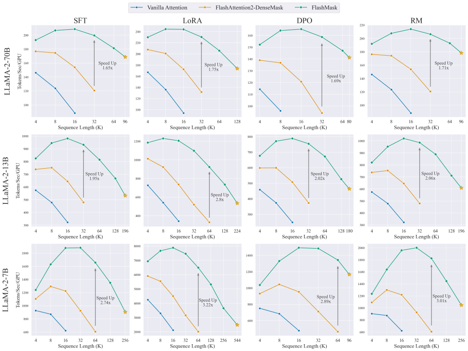
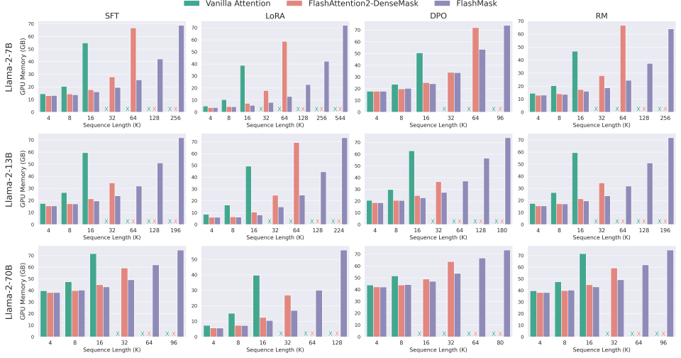
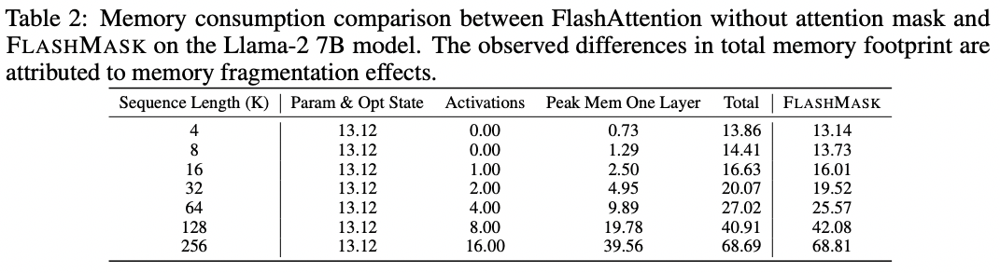
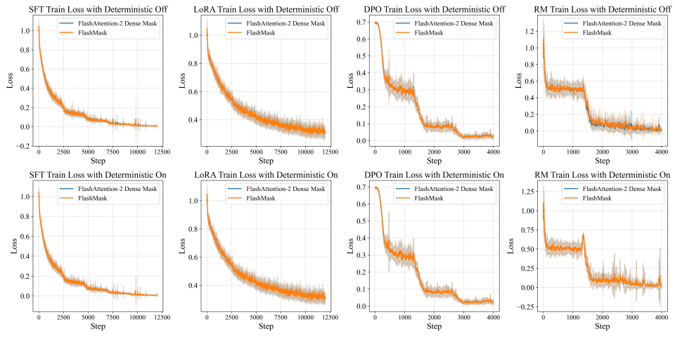
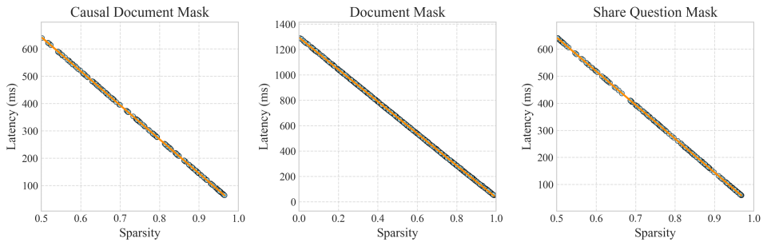
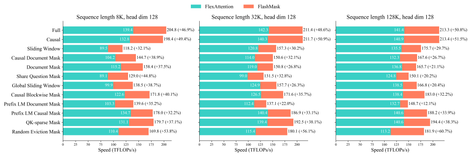

# 3. FlashMask Advantages: Improvements in Speed and Memory

## 3.1 End-to-End Training Throughput Improvement

Experiments across Llama-2 7B, 13B, and 70B models, four downstream training scenarios (SFT, LoRA, DPO, and RM), and a range of sequence lengths show that FlashMask improves end-to-end throughput and storage efficiency at every tested scale. Compared with dense mask matrix-based methods, FlashMask delivers a 1.65x to 3.22x throughput improvement and supports longer sequence lengths.

  
  

    
      Figure 6: End-to-end training throughput across four downstream training tasks (SFT, LoRA, DPO, and RM) for three Llama2 model scales at different sequence lengths
    
  

  
  

    
      Figure 7: Peak memory consumption during end-to-end training across four downstream training tasks (SFT, LoRA, DPO, and RM) for three Llama2 model scales at different sequence lengths
    
  

  
  

    
      Table 2: Memory consumption of FlashMask compared with FlashAttention (Causal=True) on the Llama2 7B model, in GB
    
  

## 3.2 End-to-End Training Convergence Verification

Experiments on the Llama 3.1 model verified that FlashMask does not affect convergence accuracy. As an exact algorithm, FlashMask can match FlashAttention with dense masks at the bit level by controlling randomness in the computation process, such as the `atomicAdd` operation used in FlashAttention's backward Query gradient computation.

  
  

    
      Figure 8: End-to-end training loss comparison of the Llama 3.1 8B model across four downstream training tasks (SFT, LoRA, DPO, and RM)
    
  

## 3.3 Linear Relationship Between Sparsity and Kernel Computation Latency

FlashMask leverages block sparsity in attention masks to skip fully masked blocks, reducing computational complexity to $O((1 - \rho)T_rT_c)$, where $\rho$ denotes block sparsity. To verify this relationship, FlashMask ran multiple experiments using three mask types, causal document masks, shared question masks, and document masks, across data with different sparsity levels. The results, shown in Figure 9, indicate a linear relationship between kernel execution latency and sparsity: as sparsity increases, FlashMask becomes faster.

  
  

    
      Figure 9: Kernel computation latency under different block sparsities
    
  

## 3.4 Kernel Performance Comparison

After PyTorch introduced FlexAttention [4], which uses compiler technology to support attention masks, FlashMask was compared against it at the kernel level. Across common attention mask patterns, FlashMask showed higher computational efficiency. In TFLOPs/s, FlashMask outperformed FlexAttention by 12.1% to 60.7% and reached 37.8% to 62.3% of the theoretical peak performance on an A100 GPU.

  
  

    
      Figure 10: Comparison of kernel forward and backward speeds on an A100-SXM 80G GPU. FlexAttention uses PyTorch 2.6.0.dev20240920+cu124
    
  

